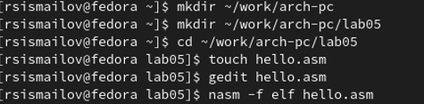
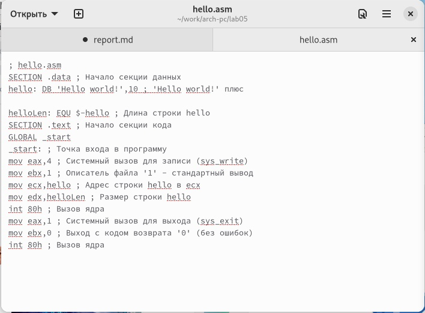
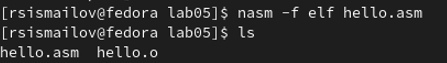
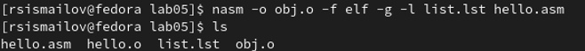
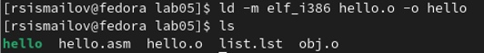
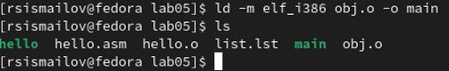
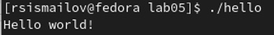
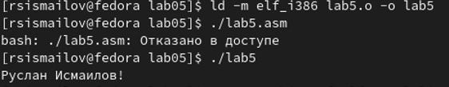

---
## Front matter
title: "Лабораторная работа №5"
author: "Руслан Шухратович Исмаилов"

## Generic otions
lang: ru-RU
toc-title: "Содержание"

## Bibliography
bibliography: bib/cite.bib
csl: pandoc/csl/gost-r-7-0-5-2008-numeric.csl

## Pdf output format
toc: true # Table of contents
toc-depth: 2
lof: true # List of figures
fontsize: 12pt
linestretch: 1.5
papersize: a4
documentclass: scrreprt
## I18n polyglossia
polyglossia-lang:
  name: russian
  options:
	- spelling=modern
	- babelshorthands=true
polyglossia-otherlangs:
  name: english
## I18n babel
babel-lang: russian
babel-otherlangs: english
## Fonts
mainfont: PT Serif
romanfont: PT Serif
sansfont: PT Sans
monofont: PT Mono
mainfontoptions: Ligatures=TeX
romanfontoptions: Ligatures=TeX
sansfontoptions: Ligatures=TeX,Scale=MatchLowercase
monofontoptions: Scale=MatchLowercase,Scale=0.9
## Biblatex
biblatex: true
biblio-style: "gost-numeric"
biblatexoptions:
  - parentracker=true
  - backend=biber
  - hyperref=auto
  - language=auto
  - autolang=other*
  - citestyle=gost-numeric
## Pandoc-crossref LaTeX customization
figureTitle: "Рис."
tableTitle: "Таблица"
lofTitle: "Список иллюстраций"
## Misc options
indent: true
header-includes:
  - \usepackage{indentfirst}
  - \usepackage{float} # keep figures where there are in the text
  - \floatplacement{figure}{H} # keep figures where there are in the text
---

# Цель работы

Освоение процедуры компиляции и сборки программ, написанных на ассемблере NASM

# Задание

Успешно использовать NASM для исполнения простейших программ

# Выполнение лабораторной работы

**Шаг 1** 
Создаём каталог для работы, используя команду
```
mkdir ~/work/arch-pc

mkdir ~/work/arch-pc/lab05
```
И переходим в него

**Шаг 2**
Убедившись, что мы в каталоге, используем команду 
```
touch hello.asm
```
Для создания текстового файла с именем hello.asm

(рис. [-@fig:001])

**Шаг 3**
Убедимся, что файл создан, откроем его с помощью текстового редактора (gedit) и вводим в него текст

(рис. [-@fig:002])


**Шаг 4**
Компилируем файл нашей программы с помощью 
```
nasm -f elf hello.asm
```
таким образом, текст hello.asm преобразуется в файл **hello.o** 

проверим его наличие:

(рис. [-@fig:003])


**Шаг 6**
Исполняем 
```
nasm -o obj.o -f elf -g -l list.lst hello.asm
```
для того, чтобы скомпилировать исходный файл hello.asm в obj.o и создадим файл листинга list.lst

(рис. [-@fig:004])

**Шаг 6**
Исполняем 
```
ld -m elf_i386 hello.o -o hello
```
и проверяем чтобы исполняемый файл **hello** был создан

(рис. [-@fig:005])


**Шаг 7**
Исполняем 
```
ld -m elf_i386 obj.o -o main
```
для того, чтобы сделать исполняемый файл **main** из объектного файла **obj.o**

(рис. [-@fig:006])

**Шаг 8**

Запускаем созданный файл 

```
./hello
```
и видим результат:

(рис. [-@fig:007])

**Шаг 9**

Копируем hello.asm с именем lab5.asm, редактируем строчку Hello world! для того, чтобы она отображала фамилию и имя и вводим:

```
nasm -f elf lab5.asm
ld -m elf_i386 lab5.o -o lab5

```

Результат:

(рис. [-@fig:008])

(рис. [-@fig:009])


**Шаг 6**


{ #fig:001 width=90% }

{ #fig:002 width=100% }

{ #fig:003 width=100% }

{ #fig:004 width=70% }

{ #fig:005 width=100% }

{ #fig:006 width=100% }

{ #fig:007 width=100% }

{ #fig:008 width=100% }

{ #fig:009 width=100% }

# Выводы

Я смог успешно работать с ассемблером NASM

