---
## Front matter
title: "Лабораторная работа №7"
author: "Руслан Шухратович Исмаилов"

## Generic otions
lang: ru-RU
toc-title: "Содержание"

## Bibliography
bibliography: bib/cite.bib
csl: pandoc/csl/gost-r-7-0-5-2008-numeric.csl

## Pdf output format
toc: true # Table of contents
toc-depth: 2
lof: true # List of figures
fontsize: 12pt
linestretch: 1.5
papersize: a4
documentclass: scrreprt
## I18n polyglossia
polyglossia-lang:
  name: russian
  options:
	- spelling=modern
	- babelshorthands=true
polyglossia-otherlangs:
  name: english
## I18n babel
babel-lang: russian
babel-otherlangs: english
## Fonts
mainfont: PT Serif
romanfont: PT Serif
sansfont: PT Sans
monofont: PT Mono
mainfontoptions: Ligatures=TeX
romanfontoptions: Ligatures=TeX
sansfontoptions: Ligatures=TeX,Scale=MatchLowercase
monofontoptions: Scale=MatchLowercase,Scale=0.9
## Biblatex
biblatex: true
biblio-style: "gost-numeric"
biblatexoptions:
  - parentracker=true
  - backend=biber
  - hyperref=auto
  - language=auto
  - autolang=other*
  - citestyle=gost-numeric
## Pandoc-crossref LaTeX customization
figureTitle: "Рис."
tableTitle: "Таблица"
lofTitle: "Список иллюстраций"
## Misc options
indent: true
header-includes:
  - \usepackage{indentfirst}
  - \usepackage{float} # keep figures where there are in the text
  - \floatplacement{figure}{H} # keep figures where there are in the text
---

# Цель работы

Освоение арифметических инструкций языка ассемблера NASM.

# Задание

Написать программу для вычисления функции из одиного из вариантов, ознакомиться с Арифметическими операциями на языке NASM

# Выполнение лабораторной работы

**Шаг 1** 

Создадим каталог лабораторной работы 7, и в нём создадим файл lab7-1.asm (не забывая перенести туда файл in_out.asm), перенесём в него текст программы 7.1. Создадим исполняемый файл и увидим символ 'j', так как сложение кодов символов 4 и 6 равняется коду символа j (в ASCII)

(рис. [-@fig:001])

**Шаг 2**

Изменим текст файла, заменим 

```
mov eax,'6'
mov ebx,'4
```
на

```
mov eax,6
mov ebx,4
```

Вместо 106, получим 10 (6+4) символ ASCII, который соответствует символу 'LF,/n',  (не отображается на экране.)

(рис. [-@fig:002])


**Шаг 3**

Создадим файл lab7-2.asm, где мы используем код из файла in_out.asm для преобразования ASCII символов в числа. Копируем код соответственного листинга 7.2, запустим исполняемый файл, :

(рис. [-@fig:003])

Получим число 106, сумму кодов символов '4' и '6'

снова заменим 

```
mov eax,'6'
mov ebx,'4
```
на

```
mov eax,6
mov ebx,4
```

и, запустив файл, получим число 10 (6+4)

(рис. [-@fig:004])

Также заменим в исходном файле функцию iprintLF на iprint

после вывода результата не переводится строка терминала 

(рис. [-@fig:005])

**Шаг 4**

В  файл lab7-3.asm введём код из листинга 7.3

найдём выражение ((5∗2)+3)/3

Создадим файл и получим ответ:

(рис. [-@fig:006])

Изменим код файла для вычисления выражения ((4∗6)+2)/5

(рис. [-@fig:007])

Ответ:

(рис. [-@fig:008])

**Шаг 5**

вводим в variant.asm код программы 7.4, проверяем его работу:

(рис. [-@fig:009])

Убедимся в правильности результата, разделим 1032225753 на 20, получим 51611287 и   13 в остатке, прибавим к остатку 1, это равняется номеру варианта

# Ответы на вопросы 1-7

1.
```
mov eax, msg

call sprintLF
```
Отвечает за вывод сообщения 'ваш вариант: ...'

2.
Данные функции используются для ввода значения переменной Х с клавиатуры и сохранения введенных данных 

3.
Данная инструкция используется для преобразования кода символа ASCII в число

4.
```
mov ebx,20
div ebx
inc edx
```

5.
В регистр edx

6.
Для увеличения значения edx на +1. 

7.
Результат вычислений:

```
mov eax,edx
call iprintLF
```

# Задание для самостоятельной работы

**Шаг 1**

Создадим файл fx.asm, где решим (x/2+8)*3 в зависимости от различных Х.

Рассмотрим принцип работы нашего кода 

```
mov eax, msg 
call sprintLF 
mov ecx, x 
mov edx, 80 
call sread 
mov eax,x 
call atoi 
xor edx,edx
```
отвечает за запись переменной Х

```
mov ebx,2 ; ebx=2
idiv ebx ; eax / 2
```
Деление Х на ebx (2)

```
add eax,8 ; eax + 8 
```
Сложение Х + 8 

```
mov ebx,3 ; ebx=3
mul ebx ; eax * ebx
```
умножение Х на ebx (3)

Запишем результат в edi, выведем на экран с помощью iprintLF

Код:
(рис. [-@fig:011])

Проверим:
(рис. [-@fig:010])

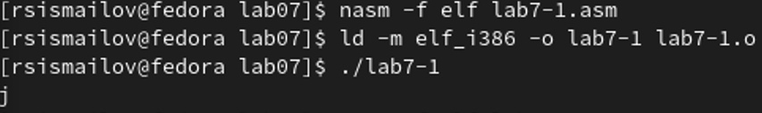{ #fig:001 width=90% }

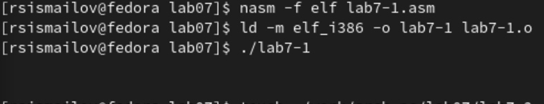{ #fig:002 width=100% }

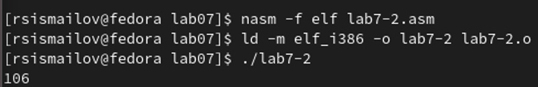{ #fig:003 width=100% }

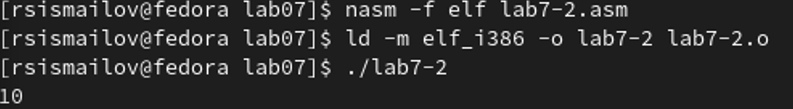{ #fig:004 width=70% }

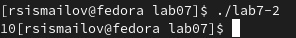{ #fig:005 width=100% }

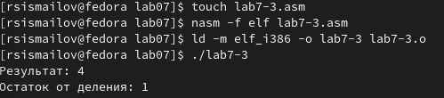{ #fig:006 width=100% }

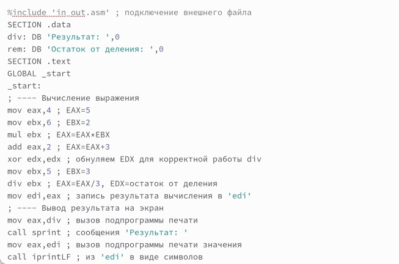{ #fig:007 width=100% }

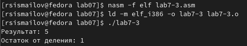{ #fig:008 width=100% }

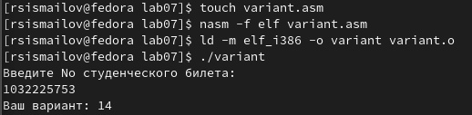{ #fig:009 width=100% }

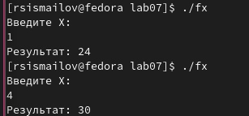{ #fig:010 width=100% }

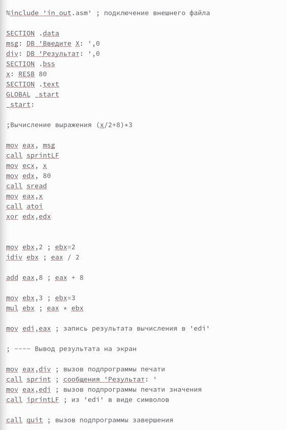{ #fig:011 width=100% }


# Выводы

Я написал программу для вычисления функции и ознакомился с принципом вычисления на языке ассемблера NASM
