---
## Front matter
title: "Лабораторная работа №8"
author: "Руслан Шухратович Исмаилов"

## Generic otions
lang: ru-RU
toc-title: "Содержание"

## Bibliography
bibliography: bib/cite.bib
csl: pandoc/csl/gost-r-7-0-5-2008-numeric.csl

## Pdf output format
toc: true # Table of contents
toc-depth: 2
lof: true # List of figures
fontsize: 12pt
linestretch: 1.5
papersize: a4
documentclass: scrreprt
## I18n polyglossia
polyglossia-lang:
  name: russian
  options:
	- spelling=modern
	- babelshorthands=true
polyglossia-otherlangs:
  name: english
## I18n babel
babel-lang: russian
babel-otherlangs: english
## Fonts
mainfont: PT Serif
romanfont: PT Serif
sansfont: PT Sans
monofont: PT Mono
mainfontoptions: Ligatures=TeX
romanfontoptions: Ligatures=TeX
sansfontoptions: Ligatures=TeX,Scale=MatchLowercase
monofontoptions: Scale=MatchLowercase,Scale=0.9
## Biblatex
biblatex: true
biblio-style: "gost-numeric"
biblatexoptions:
  - parentracker=true
  - backend=biber
  - hyperref=auto
  - language=auto
  - autolang=other*
  - citestyle=gost-numeric
## Pandoc-crossref LaTeX customization
figureTitle: "Рис."
tableTitle: "Таблица"
lofTitle: "Список иллюстраций"
## Misc options
indent: true
header-includes:
  - \usepackage{indentfirst}
  - \usepackage{float} # keep figures where there are in the text
  - \floatplacement{figure}{H} # keep figures where there are in the text
---

# Цель работы

Изучение команд условного и безусловного переходов. Приобретение навыков написания программ с использованием переходов. Знакомство с назначением и структурой файла листинга.

# Задание

Написать программу нахождения наименьшей из 3-х переменных и вычисления уравнения в зависимости от размера введенных переменных (по вариантам)

# Выполнение лабораторной работы

**Шаг 1** 

Создадим файл lab8-1.asm в каталоге для лабораторной работы 8:

введём в него код из Листинга 8.1

запустим lab8-1:

(рис. [-@fig:001])

Сообщение 1 отсутствует, хотя оно и есть в тексте файла. Использование инструкции jmp меняет порядок исполнения инструкций, позволяет исполнить _label2, потом _label3 пропустив инструкцию _label1. 

введём код из Листинга 8.2, для того чтобы программа выводила ‘Сообщение No 2’, потом ‘Сообщение No 1’, проверим работу файла:

(рис. [-@fig:002])

**Шаг 2**

Изменим код, чтобы сообщения выводились в порядке 3-2-1; добавим jmp _label3 в начале, после вывода 3 сообщения переходим в _label2, аналогично переходим в _label1, и оттуда переходим в подпрограмму завершения  

(рис. [-@fig:004])

Проверим

(рис. [-@fig:005])

**Шаг 3**

Создадим lab8-2.asm, и введем в него код из Листинга 8.3, для нахождения меньшего из 3 чисел с помощью инструкции cmp(сравнение) и jg(переход если больше), А = 20, С = 50, и переменной В

Проверим его работу для различных B:

(рис. [-@fig:006])

**Шаг 4**

Создадим файл листинга для lab8-2.asm, использовав ключ -l в команде nasm, и откроем его, чтобы ознакомиться с содержимым. Рассмотрим 3 строчки для примера структуры листинга:

(рис. [-@fig:007])

45 00000153 B8[13000000]            mov eax, msg2

45 (номер строки) 00000153 (адрес, для того чтобы инструкции по порядку выполнялись) B8 (инструкция на машинном языке) [13000000] (переменная)            mov eax, msg2 (сам текст файла)
46 00000158 E8B2FEFFFF              call sprint ; Вывод сообщения 'Наибольшее число: ' (комментарий)
47 0000015D A1[00000000]            mov eax,[max]
46,47 - номер строки;

00000158, 0000015D - адрес 

E8B2FEFFFF, A1- машинный код, инструкция на машинном языке, отвечающая за исполниение команды sprint (вывод сообщения на экран) и перемещение переменной max в eax

[00000000] - переменная

Справа находится исходный исходный код нашей программы и комментарии 

Удалим один операнд в операции, требующей два и создадим файл листинга, lab8-2.lst и посмотрим как он изменился:

(рис. [-@fig:008])

Как мы видим, в файле листинга около строчки кода находится предупреждение об ошибке. 

# Задание для самостоятельной работы

**Шаг 1**

Создадим файл min.asm для создания программы для нахождения наименьшей из 3 переменных за основу взяв код lab8-2.asm

(рис. [-@fig:009])

(рис. [-@fig:010])

Принцип работы:

Мы  записываем с клавиатуры 3 переменные, переводим их в числа

Далее как в коде Листинга 8.3, заменим jg (переход если больше) на jl (переход если меньше) (Также См комментарии в коде)

Проверяем:

(рис. [-@fig:011])

Создадим файл var14.asm для создания программы вычисления ответа на систему уравнений из двух уравнений с использованием 2 переменных a,х за основу взяв код lab8-2.asm

Как и указано в комментариях, мы записываем введённые значения а и х в переменные А и Х, преобразуем их в числа для работы с операциями сложения и умножения, и сравниваем Х и А.

Если а < х то выполняется программа вычисления 3а+1, выводим результат, в противном случае ищем 3x+1, с помощью jmp переходим в конец, где мы выводим сообщение 'Ответ: ' на экран

Код
(рис. [-@fig:012])

(рис. [-@fig:013])

Проверим

(рис. [-@fig:014])

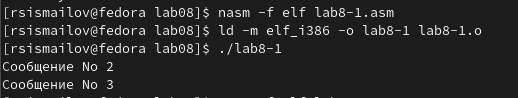{ #fig:001 width=90% }

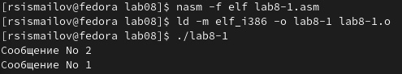{ #fig:002 width=100% }

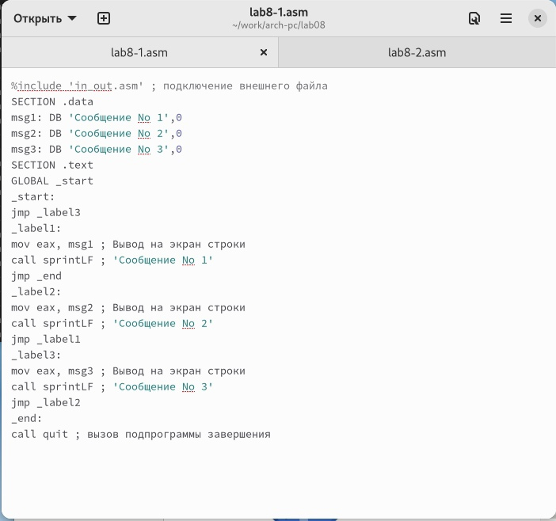{ #fig:004 width=70% }

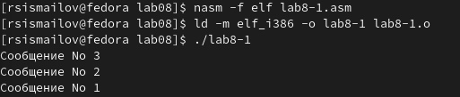{ #fig:005 width=100% }

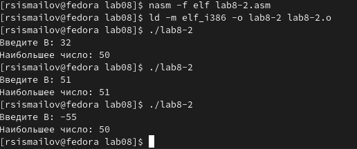{ #fig:006 width=100% }

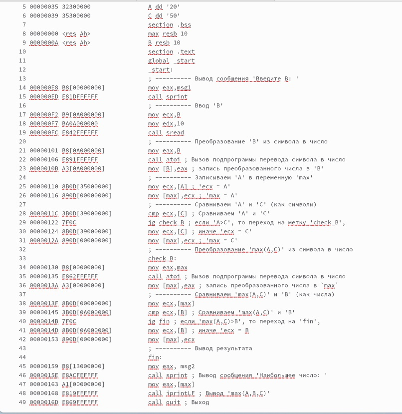{ #fig:007 width=100% }

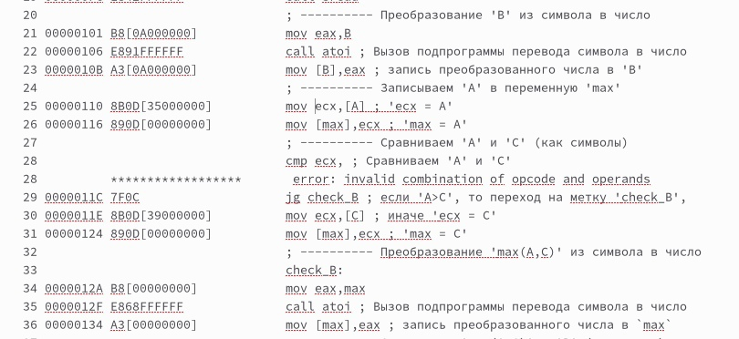{ #fig:008 width=100% }

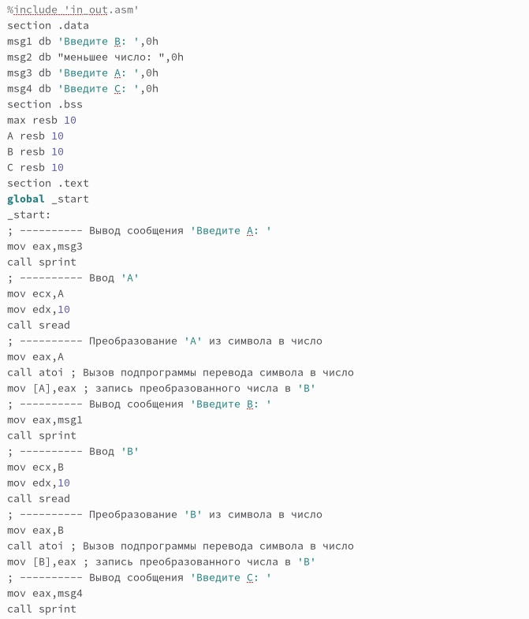{ #fig:009 width=100% }

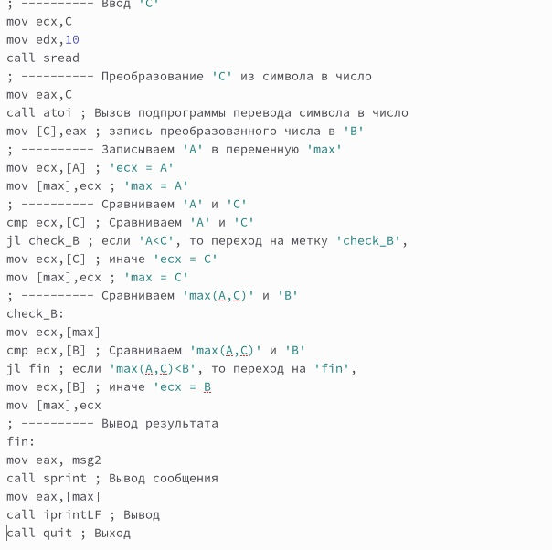{ #fig:010 width=100% }

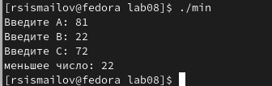{ #fig:011 width=100% }

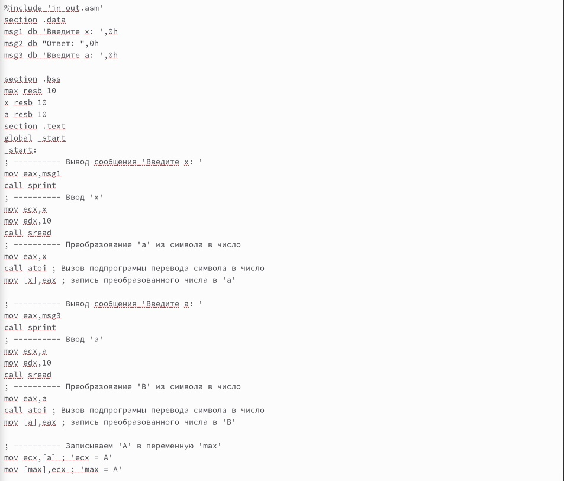{ #fig:012 width=100% }

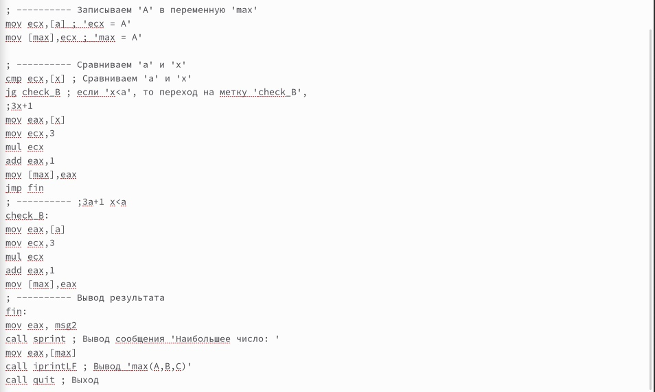{ #fig:013 width=100% }

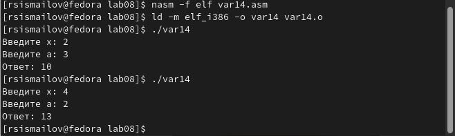{ #fig:014 width=100% }

# Выводы

Я Изучил команды условного и безусловного переходов, приобрёл навыки написания программ с использованием переходов, познакомился с назначением и структурой файла листинга 
