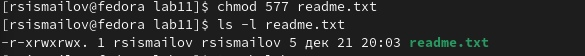

---
## Front matter
title: "Лабораторная работа №11"
author: "Руслан Шухратович Исмаилов"

## Generic otions
lang: ru-RU
toc-title: "Содержание"

## Bibliography
bibliography: bib/cite.bib
csl: pandoc/csl/gost-r-7-0-5-2008-numeric.csl

## Pdf output format
toc: true # Table of contents
toc-depth: 2
lof: true # List of figures
fontsize: 12pt
linestretch: 1.5
papersize: a4
documentclass: scrreprt
## I18n polyglossia
polyglossia-lang:
  name: russian
  options:
	- spelling=modern
	- babelshorthands=true
polyglossia-otherlangs:
  name: english
## I18n babel
babel-lang: russian
babel-otherlangs: english
## Fonts
mainfont: PT Serif
romanfont: PT Serif
sansfont: PT Sans
monofont: PT Mono
mainfontoptions: Ligatures=TeX
romanfontoptions: Ligatures=TeX
sansfontoptions: Ligatures=TeX,Scale=MatchLowercase
monofontoptions: Scale=MatchLowercase,Scale=0.9
## Biblatex
biblatex: true
biblio-style: "gost-numeric"
biblatexoptions:
  - parentracker=true
  - backend=biber
  - hyperref=auto
  - language=auto
  - autolang=other*
  - citestyle=gost-numeric
## Pandoc-crossref LaTeX customization
figureTitle: "Рис."
tableTitle: "Таблица"
lofTitle: "Список иллюстраций"
## Misc options
indent: true
header-includes:
  - \usepackage{indentfirst}
  - \usepackage{float} # keep figures where there are in the text
  - \floatplacement{figure}{H} # keep figures where there are in the text
---

# Цель работы

Приобретение навыков написания программ для работы с файлами.

# Задание

Изучить права доступа к файлам и написать файл для сохранения имени в файл name.txt

# Выполнение лабораторной работы

**Шаг 1** 

Создадим файл lab11-1.asm в каталоге для лабораторной работы 11, а также файл readme.txt:

введём в него код из Листинга 11.1

запустим lab11-1:

{ #fig:001 width=90% }

Как мы видим, программа успешно записала в файл readme.txt строчку, введенную в терминал 

**Шаг 2**

С помощью команды chmod изменим права доступа к файлу lab11-1, запретив его выполнение

Проверим

{ #fig:002 width=90% }

Как мы видим, нам отказано в доступе. 


**Шаг 3**
С помощью команды chmod изменим права доступа к файлу lab11-1.asm, добавив права на исполнение, запустим файл:

{ #fig:003 width=90% }

Файл запускается, и в терминале ошибки потому, что терминал пытается исполнить содержимое файла как консольные команды 
    
**Шаг 4**

Предоставим права доступа файлу readme.txt, в соответствии с 14 вариантом: **r-x rwx rwx**

С помощью команды с ключом 577, где 5 отвечает за исполнение x, чтение r, изменение w, и означает отсутствие   изменения файла для Пользователя, и. т. д.

```chmod 577 readme.txt
```

{ #fig:004 width=90% }

# Задание для самостоятельной работы

**Шаг 1**

Создадим файл lab11-2.asm для создания программы для записи Имени, введённого в терминал в файл name.txt.

{ #fig:005 width=90% }


Принцип работы:

Программа выводит сообщение "Как вас зовут?", 

Она записывает введенную строчку в терминал, создаёт файл name.txt, вводит введенное после сообщения "Меня зовут"

{ #fig:006 width=90% }

{ #fig:007 width=90% }


# Выводы

Я Изучил команды принцип работы права доступа к файлам и написал файл для сохранения имени в файл name.txt

